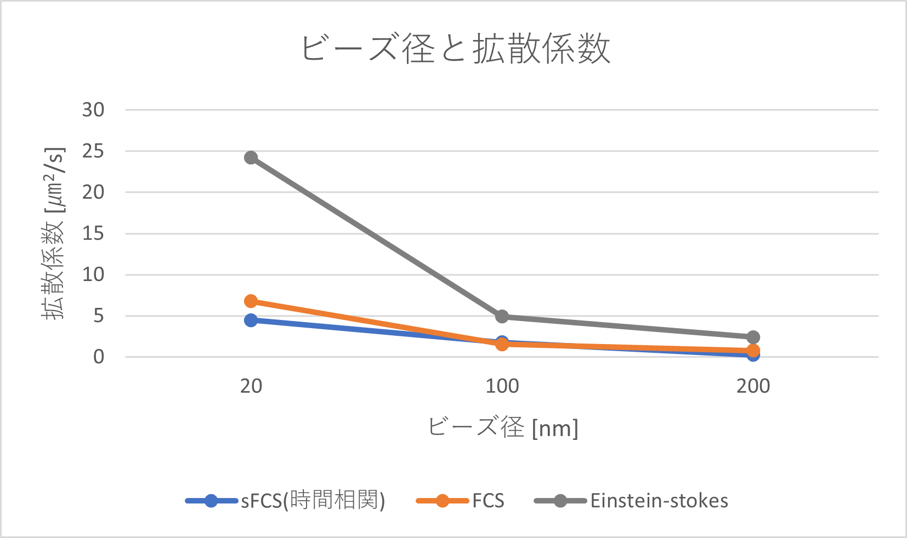
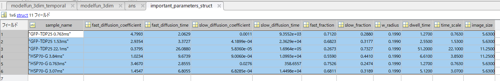
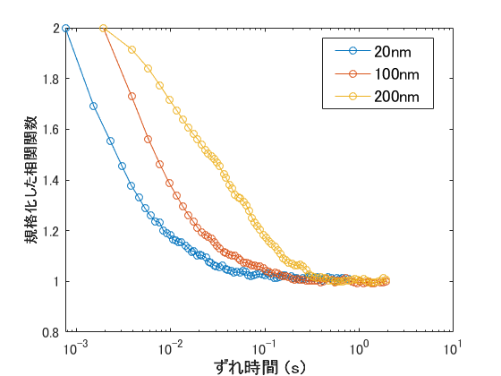

# Scanning FCS
## できること
+ 蛍光強度減衰の補正 
+ 補正した蛍光強度に基づく相関関数の計算 
→時間相関（各ピクセルの平均）/時間相関（任意の１ピクセル）/ 時空間相関　から選択可
+ 相関関数のフィッティング 
→１成分拡散/２成分拡散モデルを選択可
+ 相関関数のプロット 
+ 拡散時間、拡散係数の導出
 
## 使い方
注：DATE = yymmddの形にしてください (例：23年１月12日→ 230112)

### ①LSMデータを加える 
+ input > DATE > lsm > 全lsmファイル　という階層構造にする 
(例：input > 230112 > lsm > G-TDP25_01_line1_0.762ms.lsm, G-TDP25_01_line2_1.53ms.lsm・・)

### ②測定条件の入力 
 "script_conditions_DATE.m"（＝テンプレートファイル）を複製する 
+measurement_conditions > DATE(←新規作成する) > script_conditions_DATE.m　という階層構造にする 
(例：measurement_conditions > 230112 > script_conditions_230112.m)

+ "script_conditions_DATE.m"に変更と追記をする 
★このスクリプトに記述した全条件が解析対象になります★ 
解析したいファイルの数だけスクリプト項目を増減させる 
**注**　filename: 上記①においてinput>DATE>lsmフォルダ内に加えたlsmファイルの名前にする。 
（例：filename = G-TDP25_01_line1_0.762ms.lsm, filename = G-TDP25_01_line2_1.53ms.lsm)

### ③mainファイルを動かす 
1. "main_template.m"を複製して、別のmainファイルをつくり、mainフォルダへ移動させる
2. スクリプト上部の『要変更！！』セクションを適宜する 
3. 実行（緑の三角ボタンを押す）

**実行して得られるものと保存場所** 
★プロットはpng形式, fig形式(matlabで開ける)の両方で保存されます★ 
+ 補正前と補正後の蛍光強度プロット →"output/DATE/sample_name"フォルダ内 
+ ACFプロット →"output/DATE/sample_name"フォルダ内 
+ 拡散係数、拡散時間などのパラメータ →"workspace/DATE/important_parameters.mat" 
+ ワークスペース（プログラム実行時の変数) →"workspace/DATE/ACFの種類_filename.mat" 

## main.m挙動
最初に入力したmeasurement_conditions > DATE > script_conditions_DATE.m
**line1～63: 準備**  
measurement
**line64～109: メイン**  

## デモ

## 注意
### エラーメッセージと解決策 
①fittingでのエラー 
初期値を変えるとうまくいく

②ファイルやフォルダが存在しないというエラーメッセージ 
・script_conditionsファイルに入力した"filename"が間違っている可能性があります。 
→inputフォルダに加えたlsmファイル名と一致させるようにしてください。そして誤まった名前をもつファイルがmeasurement_conditionsフォルダに存在している可能性がありますので削除してください。

③Githubと連携したい場合は、scanning_fcs.prjをクリック。連携したいファイルやフォルダをプロジェクトに追加し、ソース管理からGithubコマンドを行う

### 場合に応じて変更
+ τの間隔設定："temporal_correlation.m" のTAU_BETWEENという変数で定義 
+ τの個数上限："main.m"のNUMBER_TAUという変数で定義 
**デフォルト：τ= TAU_BETWEEN *TIME_SCALE ** 
・TAU_BETWEEN = 10^0～10^3の範囲で対数的に等間隔な100個の点=[1,2,3,・・, 870,933,1000] 
・TIME_SCALE＝スキャンで元のピクセルに戻ってくるまでの時間

## 連絡
mail to: zakishima.39@icloud.com

## その他　使っていたもの 
### 拡散係数のプロット
+ **完成例** 
 
+ **方法**
1. workspaceファイルのimportant_parametersという変数の中身をみる 
 
2. 以下のファイルへ貼り付ける 
banana > shimazaki > 解析 > "拡散係数プロットテンプレート"

### 複数の相関関数プロット 
+ **完成例** 
 

+ **方法** 
 script > plot > overlay_diffusionCoefficient.mを使用 
１つ１つの相関関数を縦軸1～２に規格化し、重ねることができます
挙動確認後、デモ動画撮影
